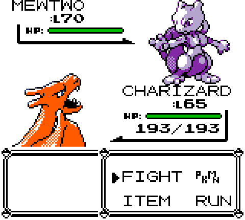

# Crystal Animated Sprites

Crystal's animated sprites in Pokemon Red, Blue and Yellow on Gen1Recomp,
decoded from your own Pokemon Crystal ROM.

**No artwork is included.** The mod reads the sprites, animation frames and
timing straight out of a Crystal ROM that you supply, builds them once, and
keeps the result in the mod's own cache. Nothing from the ROM is ever part of
the download. The animation below is a capture of the running game and is not
part of the mod.

  

## What you get

- The enemy's front sprite plays Crystal's own animation in battle, for the
  151 Kanto species. The frames, the order and the timing come from the game's
  animation scripts, not from a recording.
- Crystal's picture, at its resting frame, also replaces the front sprite on
  the other screens that show a Pokemon: the status screen, the Pokedex, the
  evolution screen, the Hall of Fame, the title screen, Prof. Oak's intro,
  trades and the credits. The Pokedex entry and the status screen play the
  animation; the other screens show the resting frame.
- Crystal's small party icons in the party menu and the PC boxes, with their
  two animation frames. Bill's PC Plus gets them too, with no changes on its
  side. They are drawn in the game's own colours.
- Options:
  - `SPRITE COLORS`. `CRYSTAL` (default) draws each Pokemon in the colours
    Crystal gave it, which needs the game's COLORS setting on ADVANCED. `GAME`
    draws the sprites in the colours of the game you are playing, so Red, Blue
    and Yellow keep their own palettes.
  - `PARTY ICONS`. `CRYSTAL` (default) uses Crystal's icons. `GAME` keeps the
    icons of the game you are playing.
  - `BACK SPRITES`, for your own Pokemon. `ANIMATED FRONT` (default) is the
    animated front sprite, mirrored, so your Pokemon animates too. `CRYSTAL` is
    Crystal's own back sprite, which is a still picture.
  - `ATTACK ANIMATION`. `ON` (default) plays a Pokemon's animation again when
    it uses a move. Crystal does not do this: `OFF` plays it only when the
    Pokemon appears.
  - `DIAGNOSTICS` (off by default) draws a few lines over the battle screen
    with the mod version, which cache it is using, how many species are ready,
    and whether each sprite comes from this mod. It is for bug reports on
    devices where the save folder cannot be opened, such as Android.
- The sprites have transparent backgrounds, so they work with mods that replace
  the battle background. Gaps that are really see-through, such as between a
  bird's feet or inside a hood, are transparent too, and many sprites were
  checked and touched up by hand so that white details that belong stay solid.

## Installing

1. Install the mod and enable it.
2. When the launcher asks for a file, pick your own **Pokemon Crystal** ROM.
   English (UE) v1.0 and v1.1 are supported; the launcher checks it for you.
3. Play. The first launch builds the sprites in the background, which takes
   about half a minute, so give it a moment before your first battle. A Pokemon
   whose sprite is not built yet shows the normal one, and switches to
   Crystal's as soon as it is ready, even in the middle of a battle.

## Notes

- Like Crystal, the front animation plays once when a Pokemon appears, as it
  lands with the cry, and then stays on its resting frame. It does not repeat.
  With `ATTACK ANIMATION` on, which is not how Crystal behaves, it plays again
  each time that Pokemon uses a move. The Pokedex entry and the
  status screen play it once each time they open. The animation at the top of
  this page repeats only because it is a GIF.
- After a Pokemon uses Transform, or after a Silph Scope reveals the Pokemon
  Tower ghost, that sprite holds Crystal's resting pose instead of animating.
- On the title screen the Pokemon is drawn in full colour right up to Red's
  outline. The logo, Red and the text are the game's own art and keep the
  game's colours.
- Crystal's colours only show when the game's COLORS setting is ADVANCED. In
  any other mode the game shades every sprite with its own palette, so
  `SPRITE COLORS` set to `CRYSTAL` looks the same as `GAME`.
- Party icons are drawn in the game's colours. Crystal colours its icons with
  a separate set of palettes that the engine does not apply to icons.
- Only front pictures are replaced outside battle. Back pictures on other
  screens (the Hall of Fame's back pass) and trainer pictures keep their
  usual art, because those screens are laid out for the original sizes.
- The built sprites take about 30 MB, because both the Crystal-colour and the
  game-colour versions are kept, so changing `SPRITE COLORS` is instant and
  needs no rebuild. A mod update that changes the sprites builds a new set, and
  the old one is left in the mod's cache folder.
- Sprites are rebuilt on their own if you swap the ROM for a different dump.

## 3D battle mods

Mods that stand the battle in a 3D scene (Potato Voxel, Battle Art Voxel)
repaint any see-through area they cannot trace back to the outside as white,
because on the original art that is a belly or an eye. That also refills the
gaps this mod clears on purpose. The mod marks those gaps with an alpha of
1/255, which is invisible when drawn, and a voxel mod that understands the mark
leaves them clear. The 2D battle screen is not affected.

The change that teaches the voxel mods about the mark is open as a pull request
for each of them. Until it is merged, those mods keep filling the gaps, exactly
as they did before.

## Conflicts

This mod replaces the same sprite slots as other sprite mods, so it cannot run
alongside `crystal_animated_sprites_with_shiny_visuals`, `gen2_shiny_visuals`,
`shiny_visuals` or `CRYSTAL_251`.

## Not included yet

Shiny palettes, the sparkle entrance, the delayed cry and the sparkle sound are
planned for a later version.

## For developers

Everything is plain Lua with no dependencies. The decoder lives in `lib/`, and
the tests run under LuaJIT. `tools/` has the sprite editor used for the hand
edits (`editor.html`) and the scripts that capture the battle and the other
screens in the real engine (`battle_shots.lua`, `screen_shots.lua`):

    luajit tests/run.lua

Tests that read a real ROM look for `CRYSTAL_ROM`, or a default path on the
author's machine, and report a skip when it is missing. Set `REQUIRE_ROM=1` to
turn a skip into a failure. The engine test is run from an engine checkout:

    cd <engine> && luajit mods/crystal_animated_sprites/tests/engine_load_test.lua

It needs a Crystal ROM at `baseroms/crystal.gbc` inside the mod folder. That
folder is git-ignored and must never be committed.
