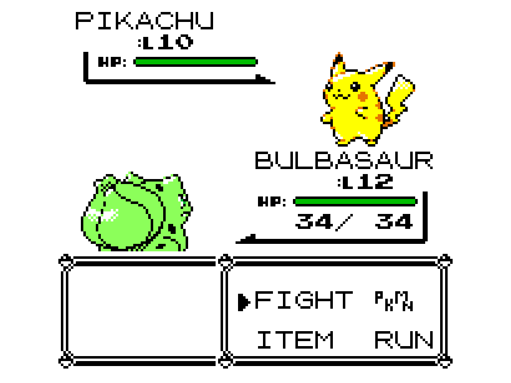
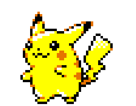

# Crystal Animated Sprites

Crystal's animated battle sprites in Pokemon Red, Blue and Yellow on
Gen1Recomp, decoded from your own Pokemon Crystal ROM.

**No artwork is included.** The mod reads the sprites, animation frames and
timing straight out of a Crystal ROM that you supply, builds them once, and
keeps the result in the mod's own cache. Nothing from the ROM is ever part of
the download. The pictures below are captures of the running game and are not
part of the mod.

## What you get

- The enemy's front sprite plays Crystal's own animation in battle, for the
  151 Kanto species. The frames, the order and the timing come from the game's
  animation scripts, not from a recording.
- A `BACK SPRITES` option for your own Pokemon:
  - `CRYSTAL` (default): Crystal's back sprite.
  - `ANIMATED FRONT`: the animated front sprite, mirrored.
- Red, Blue and Yellow keep their own colours and palettes. Only the pictures
  change.

## Installing

1. Install the mod and enable it.
2. When the launcher asks for a file, pick your own **Pokemon Crystal** ROM.
   English (UE) v1.0 and v1.1 are supported; the launcher checks it for you.
3. Play. The first launch builds the sprites in the background, which takes a
   few seconds, so give it a moment before your first battle. A Pokemon whose
   sprite is not built yet shows the normal one, and switches to Crystal's as
   soon as it is ready, even in the middle of a battle.

## Notes

- The front animation loops with a short rest on the resting frame. Crystal
  itself plays it once when a Pokemon appears.
- After a Pokemon uses Transform, or after a Silph Scope reveals the Pokemon
  Tower ghost, that sprite holds Crystal's resting pose instead of animating.
- Only battle sprites are replaced. The Pokedex, status screen and box screens
  keep their usual pictures.
- Sprites are rebuilt on their own if you swap the ROM for a different dump.

## Conflicts

This mod replaces the same sprite slots as other sprite mods, so it cannot run
alongside `crystal_animated_sprites_with_shiny_visuals`, `gen2_shiny_visuals`,
`shiny_visuals` or `CRYSTAL_251`.

## Not included yet

Shiny palettes, the sparkle entrance, the delayed cry and the sparkle sound are
planned for a later version.

## For developers

Everything is plain Lua with no dependencies. The decoder lives in `lib/`, and
the tests run under LuaJIT:

    luajit tests/run.lua

Tests that read a real ROM look for `CRYSTAL_ROM`, or a default path on the
author's machine, and report a skip when it is missing. Set `REQUIRE_ROM=1` to
turn a skip into a failure. The engine test is run from an engine checkout:

    cd <engine> && luajit mods/crystal_animated_sprites/tests/engine_load_test.lua

It needs a Crystal ROM at `baseroms/crystal.gbc` inside the mod folder. That
folder is git-ignored and must never be committed.
